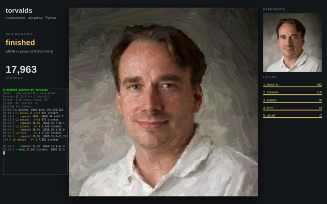

# Bot Painter

Link to create new bot: https://ql.app/l/VfIzU7dR

A test of aesthetics and visual perception. The bot paints a portrait of the person in a given X profile picture, live on its VM desktop, using only Python and a browser. No image-generation or style-transfer models. It records the painting and hands over the final PNG, an MP4 of the process, and a short brief.

## Example outcome

A sample run: the bot paints a portrait from an X profile picture, from coarse strokes to fine detail. Click the image to watch the recording.

[Watch the painting video (MP4, 1.5 min)](assets/demo.mp4)
