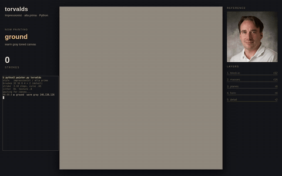

# render test (temporary)

relative video:

<video src="demo.mp4" controls muted width="480"></video>

github raw ref video:

<video src="https://github.com/hasura/multiplayerbot/raw/refs/heads/bot-assets/Bot%20Painter/assets/demo.mp4" controls muted width="480"></video>

bare raw url line:

https://github.com/hasura/multiplayerbot/raw/refs/heads/bot-assets/Bot%20Painter/assets/demo.mp4

gif:

